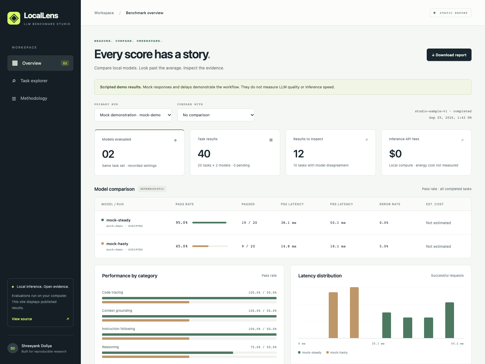

# LocalLens — LLM Benchmark Studio

**Measure local models. Inspect every failure. Reproduce the report.**

[Live dashboard](https://ShreeyankDoliya.github.io/locallens-benchmark-studio/) · [Methodology](docs/METHODOLOGY.md) · [Architecture](docs/ARCHITECTURE.md) · [Verification](docs/VERIFICATION.md)

[Research dashboard](https://shreeyankdoliya.github.io/locallens-benchmark-studio/research.html) · [Terminal-Bench paper analysis and five-benchmark plan](docs/RESEARCH.md)

LocalLens runs a versioned set of tasks against local models, saves the evidence in SQLite, and publishes portable JSON reports to a static dashboard. The complete mock workflow needs no model download, API key, cloud account, paid service, or credit card. Local model inference uses Ollama on your own computer.

The GitHub Pages site **only displays published results**. Evaluations run locally through the Python CLI. The dashboard has no backend, analytics, CDN assets, or connection to your model server.



## What works

- Versioned JSONL tasks with strict validation, original prompts, expected answers, scoring rules, and perturbation groups.
- Two scripted mock models and a modular Ollama adapter for locally installed open-weight models.
- Exact, normalized, and strict JSON checks. Every score is labeled **deterministic**; no hidden LLM judge.
- SQLite checkpoints, interrupted-run resume, per-attempt timing, timeouts, bounded retries, explicit concurrency and global request rate limits.
- Model digests, Ollama version, templates, parameters, generation settings, dataset/config/source fingerprints, UTC timestamps, host details, and raw responses.
- Model/category pass rates, p50/p90/p95 latency, error rate, perturbation consistency, disagreement filters, and optional token-based cost estimates.
- Static run comparison, searchable failure inspection, JSON downloads, Markdown reports, and GitHub Pages deployment.
- Research catalog covering Terminal-Bench 2.0, HumanEval, MBPP, GSM8K and IFEval, with pinned data sources and explicit protocol limits.
- Source-linked external GLM reference scores, the complete 89-task Terminal-Bench inventory, and real oracle/no-op Docker controls. **GLM API evaluations have not run**; these external scores are labeled separately from our measurements.

The research track keeps the original zero-cost workflow intact. Paid API inference is optional and is not implemented or required by the core runner. For research data validation and credential-free preparation:

```bash
.venv/bin/python -m benchmark_studio.research verify
.venv/bin/python -m benchmark_studio.research prepare --limit 10
```

Preparation downloads the four prompt datasets at pinned revisions, verifies hashes and splits, and saves a repeatable task selection under `runs/research/sources`. It does not perform inference or replace the official scorers. The [research analysis](docs/RESEARCH.md) contains exact Docker control commands, observed results, the remaining GLM integration work, and hardware limitations.

## Quick start: no models or API keys

Requirements: Python 3.11–3.14, Git, and an internet connection for the initial small Python dependency installation. The mock benchmark and dashboard work offline after installation. Node.js is only needed for optional browser tests.

```bash
git clone https://github.com/ShreeyankDoliya/locallens-benchmark-studio.git
cd locallens-benchmark-studio
python3 -m venv .venv
source .venv/bin/activate
python -m pip install -r requirements.txt
python -m pip install --no-deps -e .

llm-bench validate datasets/studio-sample-v1.jsonl
llm-bench run --config configs/mock.json --dataset datasets/studio-sample-v1.jsonl --run-id my-mock
llm-bench export --run-id my-mock --output dashboard/data
python -m http.server 8000 --bind 127.0.0.1 --directory dashboard
```

Open **http://127.0.0.1:8000**. Select `my-mock`, or compare it with either published example. Serve the directory over HTTP; browsers restrict `fetch` when opening `index.html` directly.

On Windows PowerShell, use `py -m venv .venv` and `.venv\Scripts\Activate.ps1`. The runner includes a Windows file-lock implementation; the checked-in CI targets Ubuntu, and development verification used macOS.

If you already use [uv](https://docs.astral.sh/uv/), `uv sync --locked` replaces the environment/install steps. `uv.lock` and `requirements.txt` pin transitive runtime dependencies. Packaging builds use the pinned Hatchling version in `pyproject.toml`.

The hosted dashboard also includes a real **Qwen2.5 0.5B / 1.5B** run on an Apple M1 Pro: **2/20** and **6/20** tasks passed the strict checks. All 40 requests completed without provider errors, with token usage recorded. See [the real-run verification](docs/VERIFICATION.md#real-local-model-verification) for commands, hardware and interpretation. These sample scores do not establish general model superiority.

The demo intentionally includes wrong answers, a recovered transient error, and an exhausted retry sequence. Its scores are **19/20 (95%)** for `mock-steady` and **9/20 (45%)** for `mock-hasty`. Those are scripted fixtures, not measurements of an LLM. Their token counts and costs are unknown, not invented.

## Run two local models

Install [Ollama](https://ollama.com/download), start it, and download the example models. No paid API or Ollama account is required for these local tags. Initial downloads require internet access and disk space.

```bash
ollama serve
```

If the Ollama desktop app already runs its server, keep using it. In another terminal:

```bash
ollama pull qwen2.5:0.5b
ollama pull qwen2.5:1.5b
ollama list
```

Edit `configs/ollama.json` and replace `hardware_notes` with your CPU, GPU, RAM/VRAM, power mode, and relevant background workload. Then:

```bash
source .venv/bin/activate
export OLLAMA_HOST=http://127.0.0.1:11434
llm-bench run --config configs/ollama.json --dataset datasets/studio-sample-v1.jsonl --run-id local-qwen-01
llm-bench export --run-id local-qwen-01 --output dashboard/data
python -m http.server 8000 --bind 127.0.0.1 --directory dashboard
```

`OLLAMA_HOST` is optional and defaults to the address above. Only loopback HTTP origins are accepted. The adapter rejects cloud-backed model metadata. `.env.example` is a reference; the CLI reads environment variables and does not automatically load dotenv files. No credentials are used or stored by either MVP adapter. Future credentialed adapters should read secrets from environment variables and exclude them from manifests.

The local configuration uses temperature 0, seed 42, a 2,048-token context, and a 256-token output cap for both models, with one request at a time. The runner uses `/api/generate` with Ollama's native model template, stores that template, and records available usage and timing fields. Model tags are mutable, so the actual local digest is captured and checked on resume. Do not replace model weights while a run is active.

See the [Ollama generation API](https://docs.ollama.com/api/generate), [local-model listing API](https://docs.ollama.com/api/tags), and model cards for [Qwen2.5 0.5B](https://ollama.com/library/qwen2.5:0.5b) and [1.5B](https://ollama.com/library/qwen2.5:1.5b). Check each model's own license before use or redistribution.

### Hardware guidance

These are practical starting points, not measured minimums or performance guarantees:

| Workflow | Suggested starting hardware | Notes |
|---|---|---|
| Mock + static dashboard | Any modern CPU, 4 GB system RAM | No GPU, model download, or inference workload |
| Qwen 0.5B / 1.5B quantized, sequential | 8 GB system RAM, several GB free disk | CPU execution is possible; a supported GPU or Apple Silicon improves speed |
| Larger models or concurrent inference | 16 GB+ RAM/VRAM, sized for the chosen model | Weight size, quantization, context/KV cache, runtime overhead and concurrency all affect memory |

The two example tags are small models, but model download size alone does not represent peak memory use. Start with concurrency 1. Close heavy applications and increase the timeout if CPU inference is slow. Local inference has no API fee; hardware, electricity, bandwidth, and your time are not free resources or included in cost estimates. The published mock timings are synthetic and cannot guide model hardware purchases.

## Interrupt and resume

Press Ctrl+C, then resume with the same database and run ID:

```bash
llm-bench run --run-id local-qwen-01 --resume
llm-bench list
```

For a repeatable checkpoint demonstration:

```bash
llm-bench run --config configs/mock.json --run-id resume-demo --max-tasks 7
llm-bench run --run-id resume-demo --resume
llm-bench export --run-id resume-demo --output dashboard/data
```

`--max-tasks` counts new model/task pairs. Successful and exhausted-error results are final; resume skips them. Start a new run to reevaluate errors. Resume reads the stored task/config snapshot rather than edited input files and refuses changed runner source, hardware/runtime details, or model manifests. Re-running resume on a completed run does nothing.

A single-writer OS lock prevents concurrent runners from sharing a database. Each final attempt and its result commit atomically. A hard kill between generation and commit can require repeating that request: this is checkpointed at-least-once execution, not an exactly-once guarantee. Interrupted attempts remain visible. Timeouts cancel the client request; an inference server may continue work after disconnection.

## Export and reproduce a report

```bash
llm-bench export --run-id my-mock --output dashboard/data
llm-bench report dashboard/data/my-mock.json --output runs/reproduced-report.md
cmp dashboard/data/my-mock.md runs/reproduced-report.md
```

`report` validates snapshot fingerprints, recomputes each deterministic judgment and all summary scores, rejects inconsistent evidence, and regenerates Markdown. It works from a published JSON file without SQLite, downloaded models, or inference. `cmp` exits 0 when the report is identical. On Windows use `Compare-Object` or compare file hashes.

Each export writes `<run-id>.json`, `<run-id>.md`, and refreshes `index.json`. Identical saved evidence produces byte-identical exports; fresh evaluations have new timestamps and latency measurements. The SQLite database in `runs/` is ignored by Git. The exported JSON contains all task prompts and raw responses, so publish datasets you intend to share.

## Test

```bash
python -m unittest discover -s tests -v
```

The Python suite covers scoring edge cases, malformed datasets, retry classification, timeouts, concurrent request limits, cancellation, crash recovery, model-digest changes, immutable resume snapshots, export traceability, and report tampering. Ollama's API is tested with an HTTP mock transport; this is not a real-model performance test.

Optional browser tests (Node.js 20+):

```bash
npm ci
npx playwright install chromium
npm run test:ui
```

If Google Chrome is already installed, `PLAYWRIGHT_CHANNEL=chrome npm run test:ui` can use it instead of downloading Chromium.

The browser suite uses the checked-in mock and real local-model reports to check comparison, filters, prompt inspection, retries, report downloads, mobile layout, missing data, themed dropdown keyboard interaction, and safe rendering of untrusted output. On Linux, use `npx playwright install --with-deps chromium` if browser system libraries are missing. CI runs Python tests, report verification, browser tests, and then deploys Pages on successful main-branch pushes.

## Deploy to GitHub Pages

The repository includes `.github/workflows/ci.yml`. It uploads only `dashboard/`; neither Python nor SQLite runs on GitHub Pages. Public repository Pages hosting is sufficient for the MVP.

For your own fork, enable Pages using **Settings → Pages → Source → GitHub Actions**, or use the CLI (requires repository administration access):

```bash
gh api --method POST repos/YOUR_USER/YOUR_REPO/pages -f build_type=workflow
# If Pages already exists, use --method PUT instead of POST.
git add dashboard/data
git commit -m "Publish benchmark results"
git push origin main
```

Then inspect deployment:

```bash
gh run list --workflow ci.yml
gh api repos/YOUR_USER/YOUR_REPO/pages --jq .html_url
```

If enabling Pages after the latest push, run `gh workflow run ci.yml`. Keep the `github-pages` environment available for deployment. The workflow uses GitHub's [custom Pages deployment workflow](https://docs.github.com/en/pages/getting-started-with-github-pages/using-custom-workflows-with-github-pages). Fork owners should replace the repository links in the dashboard and README with their own. All data/CSS/JS paths are relative, so the site works at a project subpath.

## Layout

```text
src/benchmark_studio/   typed contracts, adapters, runner, SQLite, scoring, analysis, CLI
configs/               mock and local Ollama examples
datasets/              20 original versioned JSONL tasks
dashboard/             dependency-free static HTML/CSS/JS and published evidence
tests/                 Python unit/integration and optional Playwright tests
docs/                  architecture, methodology, verification, screenshot
.github/workflows/     test and Pages deployment pipeline
```

## Boundaries and next steps

This is a small diagnostic benchmark, not a general leaderboard. Six perturbation pairs are too few to establish robust invariance. Code tasks trace short snippets; no generated code is executed. Exact checks can penalize otherwise correct explanations; normalized checks only relax case, Unicode compatibility and whitespace. Different native model templates, cold starts, host load, and server caching affect comparisons. Temperature 0 and a seed do not guarantee bitwise reproducible inference.

Unknown usage and costs stay null. Configurable `input_per_million` and `output_per_million` rates estimate observed token usage only; they do not price local energy or missing retry usage. Provider errors count as failures. Incomplete runs show completed and planned counts, and their provisional rates should not be treated as full-run results.

Optional LLM judging, semantic rubrics, generated-code execution, paid API adapters, repeated-trial confidence intervals, controlled warm-up schedules, and large-dataset pagination are future extensions. Judge-based scores must have a separate score kind and must never be merged silently into deterministic scores. The MVP does not require any of those extensions.

MIT licensed. Created by **Shreeyank Doliya**.
