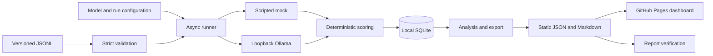
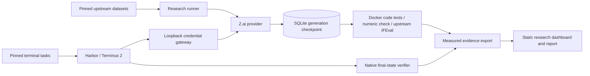

# Architecture

## Modules

| Module | Responsibility |
|---|---|
| `models.py` | Pydantic input contracts, dataset/group validation, canonical serialization and fingerprints |
| `providers.py` | Provider protocol, typed generation, mock, Ollama and optional Z.ai clients |
| `runner.py` | Snapshot creation, manifest preflight, global rate limiter, bounded async workers, timeouts and retries |
| `storage.py` | SQLite schema, OS writer lock, run state, atomic attempt/result checkpoints and crash recovery |
| `scoring.py` | Exact, normalized and strict JSON checks with explicit score kind/version |
| `analysis.py` | Evidence-derived aggregates, deterministic exports and Markdown reconstruction |
| `cli.py` | Validate, run, resume, list, export and report commands |
| `dashboard/` | Browser-only run comparison and evidence inspection, using relative static paths |

The original diagnostic runner never passes an answer or rubric to a provider. The research MBPP protocol intentionally includes its public example tests and three demonstration solutions; hidden HumanEval tests remain outside the model prompt. Its small provider contract is `manifest()`, `generate(prompt, options)` and `close()`. `Generation` carries raw text, optional token counts and provider metadata. Errors carry retryability and fatal-account classifications. The factory accepts mock, Ollama and optional Z.ai. Z.ai credentials come only from the runner environment; redirects and arbitrary API endpoints are rejected. Its manifest identifies a mutable API model alias, not a weight digest. Account failures preserve the attempt, leave the task unscored, and interrupt the run. The zero-cost core does not require a paid backend.

## Persistence and recovery

`runs` stores the immutable JSON snapshot and status. `results` has a primary key on `(run_id, model_id, task_id)`. `attempts` stores each request start and outcome separately. The event loop writes synchronously to a single SQLite connection; network calls run concurrently. A process-level advisory lock prevents two writers from evaluating the same database. SQLite WAL permits readers while the runner writes.

A terminal attempt and result are committed in one transaction. An interrupted process may leave a running attempt but cannot leave half of a terminal checkpoint. Resume marks unfinished attempts as interrupted, preserves their history, and queues only pairs with no final result. Retried completed failures are not silently re-scored. Exporting a live/incomplete run is permitted and explicitly labeled; export is best done after the runner stops.

Run status transitions are pending → running → completed, or running → interrupted → running. A completed run is immutable through the public CLI. Snapshot/config/model mismatches stop a resume; start a new run instead. Source fingerprints include all Python modules and mock fixtures, allowing uncommitted source changes to be detected without relying on Git availability.

## Static publishing

`index.json` lists published reports. The dashboard fetches only same-directory files, uses text nodes for all untrusted task/model text, and runs no model inference. There is no JavaScript build step or frontend runtime dependency. Reports carry a schema version; unknown versions are rejected. Downloads are ordinary static links.

Report file writes use temporary files followed by replacement. SQLite snapshots stay private to the machine unless manually shared; exported task prompts and responses are published when committed. No environment variable values or hostnames are automatically recorded. GPU details are user-supplied notes. The loopback HTTP client ignores proxy environment variables to keep local model traffic local.

## Scope choices

Pydantic and HTTPX keep validation and cancellable network behavior small and explicit. Tests use the standard Python `unittest` library; optional Playwright checks the actual browser workflow. A database service, paid API, frontend framework and hosted backend would add setup without helping this MVP. The static interface currently renders all result rows, so very large datasets will need pagination or virtualization.

## Optional native research track

`research.py` validates the paper catalog, dataset bytes/splits, task inventory and pinned IFEval implementation. `native_scoring.py` builds the disclosed prompts and invokes original tests/constraints. `research_run.py` shares the provider and storage interfaces while caching generations before scoring in `research_responses`. A scorer interruption can resume without requesting the same completion again. Completed results remain immutable, and requested/returned identity mismatch stops the run unscored.

`harbor_gateway.py` keeps the real API credential out of Harbor's environment and task containers. It authenticates loopback requests with an ephemeral local token, forwards only the two verified model IDs, and writes redacted call evidence. Harbor owns terminal environments, tool execution, trial resume and final-state verification. These traces are not converted into prompt exact-match tasks.

`research_export.py` joins native trial/verifier evidence with recorded calls, rejects missing or ambiguous attribution, retains exact prompts and responses, and derives summaries. The export includes task file checksums, observed Docker image digests, dependency/config fingerprints, timings and usage. It preserves external references in a separate catalog. Report-only mode validates the evidence fingerprint and recomputes aggregates; it requires neither Docker nor credentials and does not rerun code. The static viewer renders all model text as text nodes.
