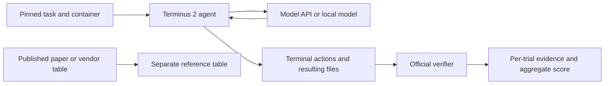

# Terminal-Bench and the GLM evaluation research track

Reviewed 29 September 2026. [Open the research dashboard](https://shreeyankdoliya.github.io/locallens-benchmark-studio/research.html).

**No GLM API evaluation has been performed.** This update provides paper analysis, pinned upstream data, the full Terminal-Bench 2.0 task inventory, two real Docker harness controls, and clearly attributed external GLM scores. It does not present published numbers as our measurements. The existing mock and local Qwen benchmarks remain available on the main dashboard.

## What the Terminal-Bench paper establishes

The supplied paper is [Terminal-Bench: Benchmarking Agents on Hard, Realistic Tasks in Command Line Interfaces, arXiv:2601.11868v1](https://arxiv.org/abs/2601.11868v1). Its contribution is a collection of 89 demanding terminal tasks and an execution protocol. Success is a property of a **model, agent, environment and budget together**. It is not an exact-match comparison between a chat response and a reference sentence.

Each task contains an instruction, an initial container environment, a reference solution and a verifier. The agent changes the environment; tests check the resulting state after execution. For example, `openssl-selfsigned-cert` requires actual certificate and key files, permissions, certificate attributes and a verification script. Saying “I created the certificate” earns no credit. The reference solution is a harness control and must never be supplied to the evaluated agent.

The paper describes collecting 229 submissions from 93 contributors and retaining 89 tasks through human review. Its experimental matrix uses multiple agent frameworks and repeated trials; model choice and scaffold both influence results. The experiments used Daytona sandboxes, with 32–100 concurrent containers. Our local Docker setup is a different execution environment. Sections 3–4 describe task construction and experiments; Appendix F explains Terminus 2; Table 2 on page 81 lists model-agent results.

**Terminus 2** is a useful common scaffold: the model produces terminal actions, a tmux session executes them, and captured terminal output returns to the model. Context condensation can incur additional model calls. A comparison must therefore record system instructions, agent version, reasoning effort, generation settings, context policy, tool access, task timeouts and all calls—not just the first prompt. The paper’s LLM-based failure taxonomy is diagnostic analysis; it is separate from binary task-verifier rewards.

Table 2 reports **GLM-4.6 with Terminus 2 at 24.5% ±2.4 percentage points**, a reported 95% confidence interval. GLM-5.3 is not a result in this January paper. The table caption says its token columns cover 74 tasks; these token totals should not be silently relabeled as totals over all 89 tasks. Public benchmark exposure, external downloads, mutable container tags and verifier coverage all limit reproducibility. A successful run does not establish general model superiority.

## Harness and repository inspection

We inspected the [official task repository](https://github.com/harbor-framework/terminal-bench-2), [Harbor](https://github.com/harbor-framework/harbor), and the [paper’s experiment repository](https://github.com/laude-institute/terminal-bench-experiments). The latter uses an editable sibling Harbor dependency; its current checkout alone is not a complete historical environment lock.

| Component | Inspected version |
| --- | --- |
| Terminal-Bench 2.0 tasks | `69671fbaac6d67a7ef0dfec016cc38a64ef7a77c`, as selected by the Harbor registry for `terminal-bench@2.0` |
| Harbor source inspection | `58789aad577f432a4590209a8fd901f8c894f382` |
| Executed harness | PyPI `harbor==0.23.0`, in an isolated Python 3.12 environment |
| Experiment repository | `043386442be68526403431b2024f50d3080abb72` |

Harbor’s job config selects tasks, environment backend, agent and repetitions. Trial results include agent/model identity, task checksum, timings, verifier reward, token/cost fields when available, and exceptions. Job directories preserve per-trial evidence and support resume. Current Harbor has evolved since the paper; our smoke test is a present-day compatibility check, not a reproduction of its exact historical harness.

The pinned task checkout contains all 89 tasks across 16 metadata categories. The dashboard inventories every task, its declared CPU/memory needs and timeout, with links to the exact prompt and verifier revision. `terminal-tasks.json` records SHA-256 hashes for every task file. The largest declared memory requirements in this checkout are 8 GiB per task. Start with one concurrent sandbox on this 16 GiB Mac; total image storage and task-specific architecture compatibility need checking before a full suite. No paid sandbox service is necessary for local Docker execution.

Inspection also shows why a verifier is an operational metric rather than proof of correctness. In [this task’s tests](https://github.com/harbor-framework/terminal-bench-2/blob/69671fbaac6d67a7ef0dfec016cc38a64ef7a77c/openssl-selfsigned-cert/tests/test_outputs.py), certificate assertions check particular attributes, and key permissions use a numeric comparison with `0600`, rather than a comprehensive permission-policy predicate. An oracle pass and no-op failure are useful checks, but do not establish that every invalid solution is rejected. We preserved upstream tests unchanged.



## Five complementary benchmark papers

| Benchmark / paper | Evaluation population | Measure and required protocol |
| --- | --- | --- |
| [Terminal-Bench](https://arxiv.org/abs/2601.11868v1), Merrill et al., 2026 | 89 tasks in version 2.0 | Agentic terminal completion; native sandbox and final-state tests |
| [HumanEval: Evaluating Large Language Models Trained on Code](https://arxiv.org/abs/2107.03374), Chen et al., 2021 | 164 Python functions | Functional correctness; original completion prompts, hidden unit tests, pass@1 for one sample |
| [MBPP: Program Synthesis with Large Language Models](https://arxiv.org/abs/2108.07732), Austin et al., 2021 | Original test IDs 11–510, 500 tasks | Basic Python synthesis; disclose provided tests and three-shot examples; do not substitute the sanitized split |
| [GSM8K: Training Verifiers to Solve Math Word Problems](https://arxiv.org/abs/2110.14168), Cobbe et al., 2021 | 1,319 test questions | Arithmetic answer accuracy; fixed prompting and explicitly recorded answer extraction |
| [IFEval: Instruction-Following Evaluation for Large Language Models](https://arxiv.org/abs/2311.07911), Zhou et al., 2023 | 541 prompts | Official verifiable constraints; strict/loose and prompt/instruction accuracy are four separate measures |

Each card in the dashboard links its paper and official implementation and describes limitations. These are public, often heavily studied datasets: contamination and saturation matter, and high scores do not demonstrate broad intelligence or safety. In particular, function-level coding tasks do not measure long-horizon repository work.

The four prompt datasets were downloaded from pinned Git revisions, counted and SHA-256 checked. HumanEval reference solutions and hidden tests must remain scoring inputs; only task prompts go to inference. MBPP’s paper-style prompts intentionally expose specified tests and demonstrations, so its protocol must be handled separately. IFEval requires upstream checkers rather than substituting keyword matching. Code execution belongs in disposable sandboxes with resource limits, no credentials, no host workspace mounts and no network access during generated-code tests.

The `research prepare` command creates a fixed hash-ordered pilot selection of ten eligible tasks per prompt benchmark. This is preparation only: it neither calls a model nor implements the four native scorers. Original data stay under ignored `runs/`, rather than being silently republished under our MIT license.

## GLM reference scores and the planned comparison

The dashboard includes GLM-5.3 and GLM-5.2 reference values from the [Z.ai release table](https://z.ai/blog/glm-5.3), with source date, metric and protocol notes. These vendor reports cover newer terminal benchmarks and other suites; they are not measurements on the five prepared datasets. There are no per-task traces for those reported scores in this repository, and no averaging across unrelated benchmarks.

[GLM-5.3’s API documentation](https://docs.z.ai/guides/llm/glm-5.3) specifies reasoning-enabled operation. It documents different protocol endpoints, including a Coding Plan route, while its examples also show the standard API route. The key’s issuing provider and subscription/usage type must be identified before choosing an endpoint. [Published Z.ai pricing](https://docs.z.ai/guides/overview/pricing) on the review date lists GLM-5.3 and GLM-5.2 at $1.40 per million uncached input tokens and $4.40 per million output tokens. Account-specific quotas and charges still need confirmation.

The next evaluation should use the same selected task IDs for both confirmed GLM model IDs, record the exact requested and returned versions, and predeclare prompt, reasoning settings and output budget. Start with a bounded pilot; label it as a subset, not a full benchmark score. Terminal tasks need a shared Terminus 2 scaffold and equal task budgets. Infrastructure errors, timeouts and model failures remain visible; repeated rollouts must not become “retry until passing.” Prefer paired per-task comparisons and disclose uncertainty instead of declaring a universal winner.

**Remaining work:** provider/account endpoint and usage budget confirmation; choosing the second API model; a tested optional API adapter with budget accounting; native scorer integration for HumanEval/MBPP/GSM8K/IFEval; actual GLM trials and their individual evidence exports. No GLM key has been written to Git, the website, a config file or a report. Static GitHub Pages remains a viewer, not a credential-bearing inference service.

## Commands and observed controls

The following are the successful preparation and verification commands used on this machine. Repository source was inspected; only the pinned task checkout and isolated installed Harbor were executed. Docker Desktop was already running. No cloud sandbox was used.

```bash
git clone --depth 1 https://github.com/harbor-framework/terminal-bench-2.git /tmp/locallens-terminal-bench-2
git -C /tmp/locallens-terminal-bench-2 fetch --depth 1 origin 69671fbaac6d67a7ef0dfec016cc38a64ef7a77c
git -C /tmp/locallens-terminal-bench-2 checkout --detach FETCH_HEAD
uv venv --python 3.12 /tmp/locallens-harbor-env
uv pip install --python /tmp/locallens-harbor-env/bin/python 'harbor==0.23.0'

.venv/bin/python -m benchmark_studio.research verify
.venv/bin/python -m benchmark_studio.research prepare --limit 10
.venv/bin/python -m benchmark_studio.research inspect-terminal --repo /tmp/locallens-terminal-bench-2 --output dashboard/research/terminal-tasks.json

/tmp/locallens-harbor-env/bin/harbor run --path /tmp/locallens-terminal-bench-2/openssl-selfsigned-cert --agent oracle --env docker --n-concurrent 1 --n-attempts 1 --max-retries 0 --jobs-dir runs/harbor --job-name tb2-oracle-smoke
/tmp/locallens-harbor-env/bin/harbor run --path /tmp/locallens-terminal-bench-2/openssl-selfsigned-cert --agent nop --env docker --n-concurrent 1 --n-attempts 1 --max-retries 0 --jobs-dir runs/harbor --job-name tb2-nop-smoke

.venv/bin/python -m benchmark_studio.research export-controls --jobs runs/harbor/tb2-oracle-smoke runs/harbor/tb2-nop-smoke --repo /tmp/locallens-terminal-bench-2 --output dashboard/research/controls.json
.venv/bin/python -m unittest discover -s tests -v
PLAYWRIGHT_CHANNEL=chrome npm run test:ui
```

| Check | Observed result |
| --- | --- |
| Reference solution | 6/6 tests pass, native reward 1, no exceptions |
| No-op | 0/6 tests pass, native reward 0, no exceptions |
| Python suite | 37 tests pass |
| Browser suite | 10 tests pass, including mobile research layout and evidence dialogs |
| API inference | None; $0 API fees incurred by this research work |

Hardware: Apple M1 Pro, 8 CPU cores, 16 GiB unified memory, macOS 26.6.2; Docker Engine 29.7.2. Docker reports 8 CPUs and 16,746,086,400 bytes of VM memory. The official certificate image is **amd64**, running on this arm64 host; emulation and environment setup affect wall time. Recorded image digest: `alexgshaw/openssl-selfsigned-cert@sha256:4c948a4e630af2435ae0a19108fc0814a946ac2fa29a512469e0fc77b38c8c12`. The task still references an upstream image tag and downloads dependencies at verification time, so even a pinned Git checkout does not freeze every dependency.

Re-exporting the saved native control files reproduces `controls.json`. Re-running the task itself changes dates, generated certificates and timings. Use a new job name for a new run. Resume an interrupted existing job with `harbor jobs resume --job-path runs/harbor/JOB_NAME`; this resumes the native harness, independently of LocalLens’s SQLite prompt-run resumability.

Preview with `python3 -m http.server 8000 --bind 127.0.0.1 --directory dashboard` and open `/research.html`. The normal Pages workflow publishes these static assets after tests pass. Source metadata and the original task instruction retain their upstream attribution; see [third-party notices](THIRD_PARTY.md).
