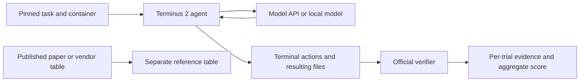

# Terminal-Bench and the GLM evaluation research track

Reviewed 29 September 2026. [Open the research dashboard](https://shreeyankdoliya.github.io/locallens-benchmark-studio/research.html).

**Live pilot completed for GLM-5.3 and GLM-5.3-Flash.** We evaluated 10 preselected tasks each from HumanEval, MBPP, GSM8K and IFEval, plus three native Terminal-Bench tasks per model. [The generated report](../dashboard/research/report.md) and [complete evidence](../dashboard/research/measurements.json) contain the measured outcomes. These small subsets cannot establish overall model superiority or reproduce the papers' full leaderboards.

The user-authorized standard API route returned account error `1113`. The documented Coding Plan route worked, but `glm-5.2` was silently routed to `glm-5.3` in two checks; `glm-4.7` was routed to `glm-5.3-flash`. Explicit `glm-5.3-flash` requests returned that identity correctly. We used it as the second model and enforce exact requested/returned identity equality. No independently measured GLM-5.2 score is claimed. Seven access probes are published separately from benchmark scores. The local/mock workflow still requires no paid service.

## What the Terminal-Bench paper establishes

The supplied paper is [Terminal-Bench: Benchmarking Agents on Hard, Realistic Tasks in Command Line Interfaces, arXiv:2601.11868v1](https://arxiv.org/abs/2601.11868v1). Its contribution is a collection of 89 demanding terminal tasks and an execution protocol. Success is a property of a **model, agent, environment and budget together**. It is not an exact-match comparison between a chat response and a reference sentence.

Each task contains an instruction, an initial container environment, a reference solution and a verifier. The agent changes the environment; tests check the resulting state after execution. For example, `openssl-selfsigned-cert` requires actual certificate and key files, permissions, certificate attributes and a verification script. Saying “I created the certificate” earns no credit. The reference solution is a harness control and must never be supplied to the evaluated agent.

The paper describes collecting 229 submissions from 93 contributors and retaining 89 tasks through human review. Its experimental matrix uses multiple agent frameworks and repeated trials; model choice and scaffold both influence results. The experiments used Daytona sandboxes, with 32–100 concurrent containers. Our local Docker setup is a different execution environment. Sections 3–4 describe task construction and experiments; Appendix F explains Terminus 2; Table 2 on page 81 lists model-agent results.

**Terminus 2** is a useful common scaffold: the model produces terminal actions, a tmux session executes them, and captured terminal output returns to the model. Context condensation can incur additional model calls. A comparison must therefore record system instructions, agent version, reasoning effort, generation settings, context policy, tool access, task timeouts and all calls—not just the first prompt. The paper’s LLM-based failure taxonomy is diagnostic analysis; it is separate from binary task-verifier rewards.

Table 2 reports **GLM-4.6 with Terminus 2 at 24.5% ±2.4 percentage points**, a reported 95% confidence interval. GLM-5.3 is not a result in this January paper. The table caption says its token columns cover 74 tasks; these token totals should not be silently relabeled as totals over all 89 tasks. Public benchmark exposure, external downloads, mutable container tags and verifier coverage all limit reproducibility. A successful run does not establish general model superiority.

## Harness and repository inspection

We inspected the [official task repository](https://github.com/harbor-framework/terminal-bench-2), [Harbor](https://github.com/harbor-framework/harbor), and the [paper’s experiment repository](https://github.com/laude-institute/terminal-bench-experiments). The latter uses an editable sibling Harbor dependency; its current checkout alone is not a complete historical environment lock.

| Component | Inspected version |
| --- | --- |
| Terminal-Bench 2.0 tasks | `69671fbaac6d67a7ef0dfec016cc38a64ef7a77c`, as selected by the Harbor registry for `terminal-bench@2.0` |
| Harbor source inspection | `58789aad577f432a4590209a8fd901f8c894f382` |
| Executed harness | PyPI `harbor==0.23.0`, in an isolated Python 3.12 environment |
| Experiment repository | `043386442be68526403431b2024f50d3080abb72` |

Harbor’s job config selects tasks, environment backend, agent and repetitions. Trial results include agent/model identity, task checksum, timings, verifier reward, token/cost fields when available, and exceptions. Job directories preserve per-trial evidence and support resume. Current Harbor has evolved since the paper; our smoke test is a present-day compatibility check, not a reproduction of its exact historical harness.

The pinned task checkout contains all 89 tasks across 16 metadata categories. The dashboard inventories every task, its declared CPU/memory needs and timeout, with links to the exact prompt and verifier revision. `terminal-tasks.json` records SHA-256 hashes for every task file. The largest declared memory requirements in this checkout are 8 GiB per task. Start with one concurrent sandbox on this 16 GiB Mac; total image storage and task-specific architecture compatibility need checking before a full suite. No paid sandbox service is necessary for local Docker execution.

Inspection also shows why a verifier is an operational metric rather than proof of correctness. In [this task’s tests](https://github.com/harbor-framework/terminal-bench-2/blob/69671fbaac6d67a7ef0dfec016cc38a64ef7a77c/openssl-selfsigned-cert/tests/test_outputs.py), certificate assertions check particular attributes, and key permissions use a numeric comparison with `0600`, rather than a comprehensive permission-policy predicate. An oracle pass and no-op failure are useful checks, but do not establish that every invalid solution is rejected. We preserved upstream tests unchanged.



## Five protocols actually exercised

| Benchmark / paper | Pilot and deterministic scoring | What it cannot establish |
| --- | --- | --- |
| [Terminal-Bench](https://arxiv.org/abs/2601.11868v1) | Three resource-selected native Docker tasks (`regex-log`, `fix-git`, `openssl-selfsigned-cert`), Terminus 2, original final-state verifier | Full 89-task performance, historical scaffold parity or model-only capability |
| [HumanEval](https://arxiv.org/abs/2107.03374) | Ten tasks; chat wrapper requests the complete Python function; original hidden tests run in a container; one completion per task | Full pass@1, production software quality or resistance to benchmark exposure |
| [MBPP](https://arxiv.org/abs/2108.07732) | Ten original test-split tasks (IDs 11–510); three-shot examples 2, 3, 4; supplied tests; original assertions; challenge tests excluded | Full test-set performance; the original dataset contains wording/test inconsistencies |
| [GSM8K](https://arxiv.org/abs/2110.14168) | Ten test questions, zero-shot; numeric equality after a final `####` marker | Reasoning validity, learned-verifier results or general mathematical ability |
| [IFEval](https://arxiv.org/abs/2311.07911) | Ten exact original prompts and pinned upstream checkers; strict prompt accuracy primary, strict/loose instruction and prompt accuracy also exported | General helpfulness, semantics or unconstrained instruction following |

The four prompt subsets were selected **before inference**, by ascending SHA-256 of `locallens-pilot-v1:benchmark:id`, taking ten per benchmark. `research prepare` checks the immutable source bytes, row counts and split membership before creating `selection.json`. Terminal tasks were hand-selected for available machine resources, not randomly sampled. Both models get identical membership and prompts, one completion/trial each, temperature 1, top-p 1, enabled thinking, high reasoning effort and an 8,192-token output cap. No judge model assigns these scores. Code extraction only removes whole-response Python fences and optional MBPP delimiters; there are no model-specific repairs.

Prompt inference uses two workers, one global request start per second, 300-second timeouts and at most two retries for transient request failures. A failed or timed-out final response counts in the denominator. Scorer infrastructure errors interrupt the run rather than generating model failures. Model responses are checkpointed before scoring, so retrying a failed scorer uses the saved response without another API call. A provider identity mismatch interrupts unscored. The runner also preserves unsuccessful/interrupted attempts; a hard kill before the generation checkpoint can still require a repeated request.

HumanEval and MBPP execute in a digest-pinned Python 3.12.13 container: no network, no host mounts or credentials, read-only root, non-root UID, 512 MB memory, one CPU, 64 processes, 64 MB temporary storage, CPU/file-size limits and a 20-second wall timeout. The official HumanEval and MBPP tests are used, but the chat prompting is an explicit adaptation. A Docker failure is distinguished from a program test failure. Docker isolation is useful containment, not a proof against hostile kernel exploits.

IFEval uses the pinned upstream implementation and English `punkt_tab` data checksums. Python dependencies are in `requirements-research.txt`. Language detection/random choices are seeded. Native generation settings, selected tasks, source/scorer hashes, host runtime and image digest are immutable resume metadata. Model weights behind API aliases cannot be frozen.

The Terminal-Bench run uses **Harbor 0.23.0 / Terminus 2**, one concurrent trial, one attempt, a shared **32,768-token context budget and 50-turn cap**, with native per-task timeouts and 8,192 output tokens per call. Job retries default to zero; Harbor’s LLM layer permits three call attempts with exponential waits, distinct from task repetitions. `requirements-harbor.txt` captures all installed harness packages. This constrained pilot does not use the models' advertised maximum context. A loopback gateway keeps the actual API key in host memory, provides only a random local token to Harbor, records redacted requests/responses, enforces the two confirmed model identities and limits request starts to one per second. Native agent trajectories, actual API payloads, verifier tests, rewards, task checksums, usage and timings are exported. No cloud sandbox was used.

The generation and terminal jobs initially overlapped on the same account/host; load and service contention are additional timing confounders. Prompt latency is API wall time excluding scoring; terminal latency is agent execution wall time including tools but excluding setup/verifier. The dashboard plots every observed latency and reports linearly interpolated p50/p95. Ten or three observations give weak tail estimates. Do not combine rates or directly compare these different latency definitions.

### Results, controls and a dataset caveat

The generated report is the authoritative aggregate: every score is recalculated from individual evidence, and it includes failures. The dashboard provides benchmark/model/failure/disagreement filters and exact prompt, response, expected result, judgment and provenance dialogs. Published vendor numbers remain in a separate external-reference section; no responses or reproductions are claimed for them.

The live prompt pilot stopped after eight saved results, then resumed to 80 without repeating completed pairs. Control checks accepted a sampled HumanEval and MBPP reference solution and rejected empty programs; an IFEval keyword control accepted and rejected the expected answers. The native `openssl-selfsigned-cert` oracle passed all six verifier tests and the no-op failed all six. Those two controls are separately labeled, not model measurements. The certificate verifier's numeric permission check is not a comprehensive permission-policy validator; controls on one task do not validate all 89 task environments.

**MBPP 313 is ambiguous:** its wording asks to print positive numbers, but its reference returns the first nonnegative number, and `assert pos_nos(...) == 1,2` uses `2` as the assertion message, not an expected second value. Both measured outputs failed the original tests. We retain that preselected task and flag the issue rather than removing it after seeing outcomes. This failure alone is not clean evidence of a coding defect.

**GSM8K 1288 also exposes a scoring limitation:** GLM-5.3 correctly computed 2,040 minutes, equivalent to the reference 34 hours, but the question did not specify the unit. The declared numeric check marks it wrong. We preserve that strict score and explicitly identify the unit ambiguity; it is not an arithmetic failure. GSM8K final-answer matching does not validate intermediate reasoning. IFEval strict failures can penalize formatting despite otherwise useful prose. Public benchmark contamination, single samples, adapted prompts and dataset imperfections prevent universal model rankings. No confidence interval from a full published benchmark applies to these subsets.

### Cost and model identity

Model IDs and endpoints were checked against [Z.ai documentation](https://docs.z.ai/guides/llm/glm-5.3), but actual returned identity is the measurement label. The supplied 5.2 request was redirected; a separate 5.2 comparison requires a route that actually returns 5.2. No spending ceiling was imposed by the user. The pilot size is a declared evaluation scope, not a billing cap.

The Coding Plan route records token usage. Subscription/point deductions and dollar charges are not available to this harness and are **unknown**, not zero. Standard API list prices are not substituted for an account bill. Missing/retry usage is not invented. The private raw runs and SQLite files remain ignored by Git; only explicit evidence exports are published. GitHub Pages never receives the API key or performs inference.

## Reproduce the measured pilot

Start with the normal README setup, Docker running, and Python 3.12. These are the commands used; the initial Terminal-Bench checkout under `runs/` was copied from the already-pinned `/tmp/locallens-terminal-bench-2`, while the public clone commands below produce the same revision independently.

```bash
.venv/bin/python -m pip install -r requirements-research.txt
.venv/bin/python -m benchmark_studio.research verify
.venv/bin/python -m benchmark_studio.research prepare --limit 10
.venv/bin/python -m benchmark_studio.research prepare-scorers

git clone https://github.com/harbor-framework/terminal-bench-2.git runs/research/terminal-bench-2
git -C runs/research/terminal-bench-2 checkout --detach 69671fbaac6d67a7ef0dfec016cc38a64ef7a77c
uv venv --python 3.12 /tmp/locallens-harbor-env
uv pip install --python /tmp/locallens-harbor-env/bin/python -r requirements-harbor.txt
docker pull python@sha256:229a2c5bfa27522db7815ea81f9bed70af17ccb9de9fc7ad142b1877b5830d36
```

Run the prompt pilot. The first command deliberately checkpoints after eight model/task pairs; repeating without `--max-new` resumes the same immutable run. The key is entered at a hidden prompt. Do not change scorer source or model/settings while resuming.

```bash
ZAI_BASE_URL=https://api.z.ai/api/coding/paas/v4 NLTK_DATA=runs/research/nltk_data .venv/bin/python -m benchmark_studio.research_run --run-id glm-native-pilot-v1 --image python@sha256:229a2c5bfa27522db7815ea81f9bed70af17ccb9de9fc7ad142b1877b5830d36 --prompt-key --max-new 8 --output runs/glm/native-pilot.json
ZAI_BASE_URL=https://api.z.ai/api/coding/paas/v4 NLTK_DATA=runs/research/nltk_data .venv/bin/python -m benchmark_studio.research_run --run-id glm-native-pilot-v1 --image python@sha256:229a2c5bfa27522db7815ea81f9bed70af17ccb9de9fc7ad142b1877b5830d36 --prompt-key --output runs/glm/native-pilot.json
```

Run the six native terminal trials through the credential-isolating gateway:

```bash
.venv/bin/python -m benchmark_studio.harbor_gateway --harbor /tmp/locallens-harbor-env/bin/harbor --config configs/harbor-glm-pilot.json
```

If interrupted, resume through the gateway so it continues recording API evidence:

```bash
.venv/bin/python -m benchmark_studio.harbor_gateway --harbor /tmp/locallens-harbor-env/bin/harbor --resume runs/harbor/glm-terminal-pilot-v1
```

Use new run/job names and a separate gateway `--log` for an independent experiment; never retry trials until they pass. The checked-in config is for this declared six-trial pilot. Full 89-task or repeated-rollout evaluation needs separate resource planning and a new configuration.

Publish the completed measurements and regenerate the report from saved evidence:

```bash
.venv/bin/python -m benchmark_studio.research_export
.venv/bin/python -m benchmark_studio.research_export --report-only dashboard/research/measurements.json --report runs/glm/reproduced-report.md
cmp dashboard/research/report.md runs/glm/reproduced-report.md
.venv/bin/python -m unittest discover -s tests -v
PLAYWRIGHT_CHANNEL=chrome npm run test:ui
python3 -m http.server 8000 --bind 127.0.0.1 --directory dashboard
```

Open `/research.html`. The static export includes full native prompts, responses, test outcomes and agent trajectories; report regeneration verifies fingerprints and recomputes aggregates without model calls, Docker or optional scorer dependencies. It does not reexecute generated code. A fresh evaluation changes sampled responses, timestamps and latency.

### Hardware and deployment

Executed on Apple M1 Pro, 8 CPU cores, 16 GiB unified memory, macOS 26.6.2; Docker Engine 29.7.2 and Python 3.12.13. The Docker VM reported 8 CPUs and 16,746,086,400 bytes of memory. Official terminal images are amd64 and run under emulation on this arm64 host. Prompt inference is remote; provider compute details are unavailable. The code scorer uses the digest-pinned Python image above. Terminal task revisions are pinned, but their image tags and network-installed dependencies can still drift.

For this pilot, use 16 GB RAM and roughly 20 GB free Docker disk as starting guidance, with one terminal trial at a time. This is not a proven minimum. The full 89-task set has much larger per-task resource declarations; inspect `terminal-tasks.json` before expansion. The ordinary mock workflow needs no Docker or API credentials.

The existing GitHub Actions workflow tests Python and the browser before publishing only `dashboard/` to GitHub Pages. See the README for deployment commands and [third-party notices](THIRD_PARTY.md) for the selected upstream task content. The supplied PDF itself is not redistributed.
