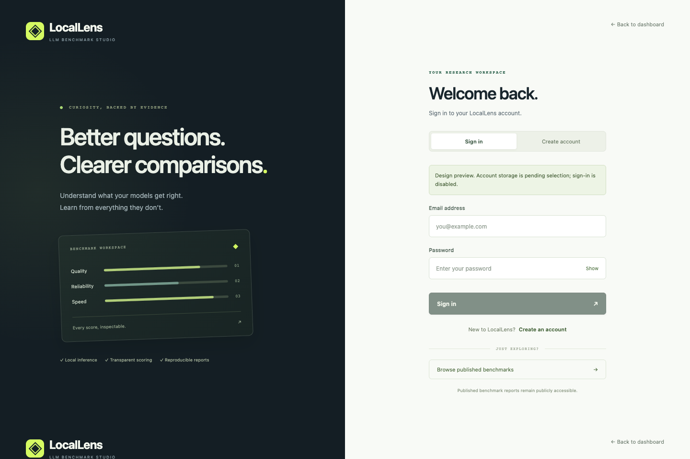
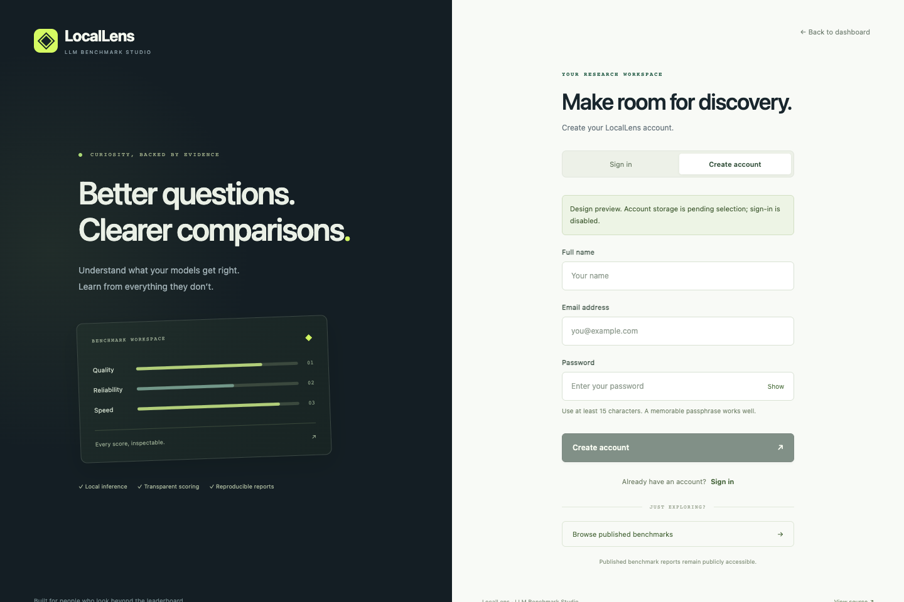

# Account screen design preview

`login.html` and `login.html?mode=signup` are responsive visual drafts for the requested account flow. Credential submission is disabled. They are not part of the deployed dashboard and do not save passwords or claim to authenticate anyone.

The account-storage decision is pending: a local Python/SQLite service would support accounts on the user's computer; authentication on the public GitHub Pages site requires a separate hosted authentication backend. Passwords must be handled by that backend and stored as salted password hashes. GitHub Pages cannot provide this service by itself.

Preview from the repository root:

```bash
python3 -m http.server 8001 --bind 127.0.0.1
```

Open `http://127.0.0.1:8001/docs/design/login.html` or append `?mode=signup`. These drafts use the dashboard stylesheet, semantic form labels, email/password autocomplete, a password visibility toggle, and mobile layouts. They intentionally have no functioning signup/login endpoint until the backend choice is resolved.

## Previews




